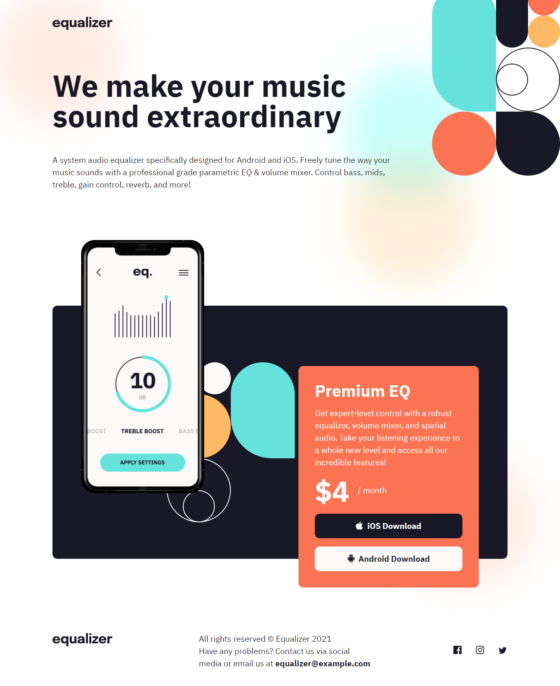
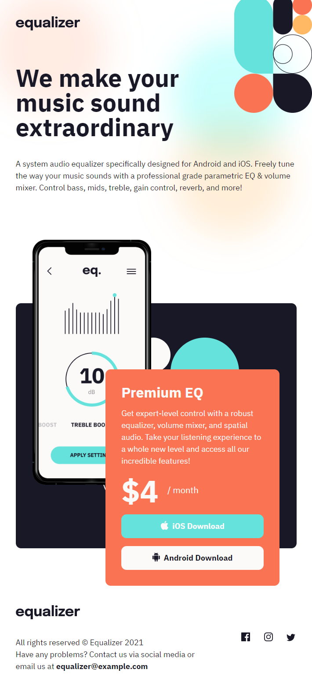
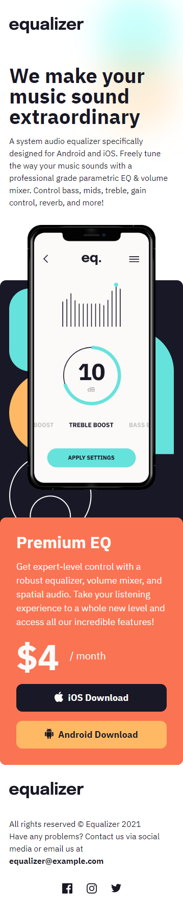

# Frontend Mentor - Equalizer landing page solution

This is a solution to the [Equalizer landing page challenge on Frontend Mentor](https://www.frontendmentor.io/challenges/equalizer-landing-page-7VJ4gp3DE). Frontend Mentor challenges help you improve your coding skills by building realistic projects.

## Table of contents

- [Frontend Mentor - Equalizer landing page solution](#frontend-mentor---equalizer-landing-page-solution)
  - [Table of contents](#table-of-contents)
  - [Overview](#overview)
    - [The challenge](#the-challenge)
    - [Desktop Screenshot](#desktop-screenshot)
    - [Tablet Screenshot](#tablet-screenshot)
    - [Mobile Screenshot](#mobile-screenshot)
    - [Links](#links)
  - [My process](#my-process)
    - [Built with](#built-with)
    - [The Man Remembers 😶](#the-man-remembers-)
  - [The BIG ISSUE](#the-big-issue)
  - [Author](#author)

## Overview

### The challenge

Users should be able to:

- [x] View the optimal layout depending on their device's screen size
- [x] See hover states for interactive elements

### Desktop Screenshot



### Tablet Screenshot

<details>
  <summary><b>Click the caret to view the tablet screenshot</b></summary>
  
</details>

### Mobile Screenshot

<details>
  <summary><b>Click the caret to view the mobile screenshot</b></summary>
  
</details>

### Links

- [My Frontend Mentor Solution](https://www.frontendmentor.io/solutions/the-art-of-flexing-css-to-your-will-T1vVVOds_I) of the Equalizer landing page challenge.
- [Live site](https://matondo99.github.io/equalizer-landing-page/) of the Equalizer landing page.

## My process

### Built with

- Semantic HTML5 markup
- CSS custom properties
- Flexbox
- Mobile-first workflow

### The Man Remembers 😶

Made an extensive use of CSS `background` property for acurate tuning like:

```css
  body {
    background-image: url(../images/bg-pattern-1.svg), url(../images/bg-main-tablet.png);
    background-position: 75vw -1.5vw, -7em -7em;
    background-size: 25%, 125%;
  }
```
Insert `.svg` image files two ways:

1. Embedded in the HTML `img` element, therefore cacheable but incapsulated and impossible to enteract with via CSS or Javascript:

      ```html
      <div class="intro flowise">
          
          <h1>We make your music sound extraordinary</h1>
          <p>A system audio equalizer specifically designed for Android and iOS. Freely tune the  way your music sounds with a professional grade parametric EQ & volume mixer. Control  bass, mids, treble, gain control, reverb, and more!</p>
        </div>
      ```

2. As plain and simple HTML element with the drawback of a cumbersome markup fastidious to maintain but now with full access to the blazing flexibility of the **Scalable Vector Graphic:**

      ```html
      <li><a href="#" aria-label="facebook"><svg width="20" height="20" xmlns="http://www.w3.org/2000/svg"><path d="M18.896 0H1.104C.494 0 0 .494 0 1.104v17.793C0 19.506.494 20 1.104 20h9.58v-7.745H8.076V9.237h2.606V7.01c0-2.583 1.578-3.99 3.883-3.99 1.104 0 2.052.082 2.329.119v2.7h-1.598c-1.254 0-1.496.597-1.496 1.47v1.928h2.989l-.39 3.018h-2.6V20h5.098c.608 0 1.102-.494 1.102-1.104V1.104C20 .494 19.506 0 18.896 0Z"/></svg></a></li>
      ```

     Notice the `aria-label` property since anchor elements require some piece of information for accessibility issues like text readers, and also notice that I removed from the original file the `fill` property, last property of the `path` element to make it available in CSS for UX purposes :

     ```css
     .sns-box a svg path {
        fill: var(--clr-neutral-80);
        transition: fill 100ms ease-out;
      }

      .sns-box a:focus svg path,
      .sns-box a:hover svg path {
        fill: var(--clr-primary-10);
      }
     ```

## The BIG ISSUE

After deployment multiple background display was just calamitous on desktop for MSEdge and Google Chrome. After multiple commits I fixed that out by removing background from the body to a general wraper.

```html
<body>
  <div class="background">
    <!--  All the content -->
  </div>
</body>
```

Accordingly CSS went from the first quoted code in [The Man Remembers 😶](#the-man-remembers-) to this:

```css
  .background {
    background-image: url(../images/bg-pattern-1.svg), url(../images/bg-main-tablet.png);
    background-position: 75vw -1.5vw, -7rem -7rem;
    background-size: 25%, 125%;
}
```

## Author

- Github - [Astar Bahouidi](https://github.com/Matondo99)
- Frontend Mentor - [@Matondo99](https://www.frontendmentor.io/profile/Matondo99)
